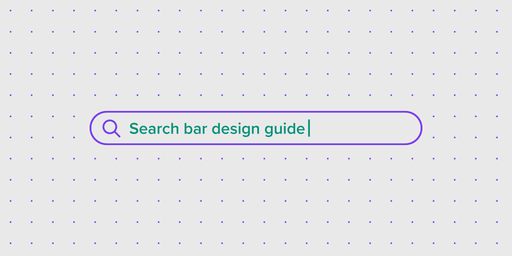
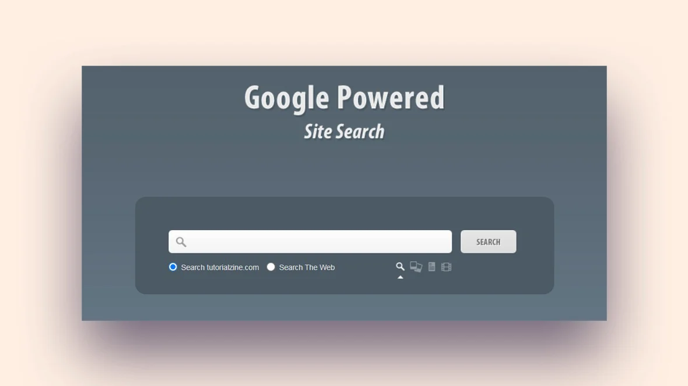
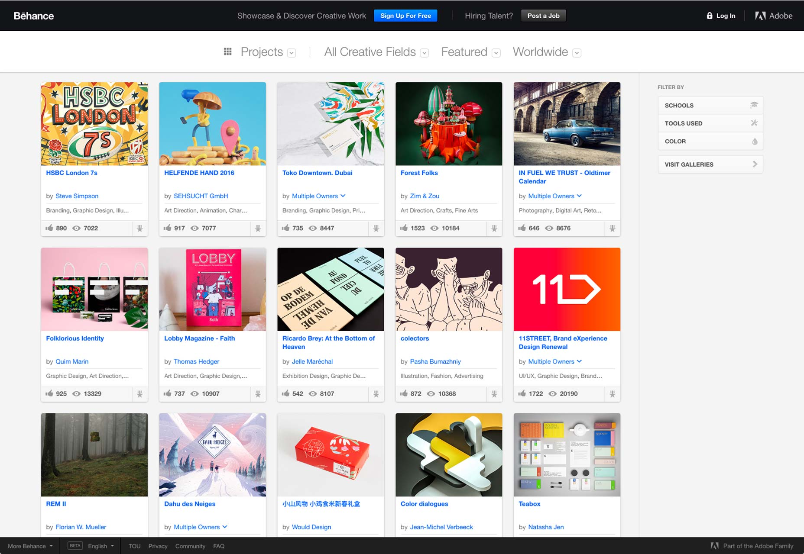
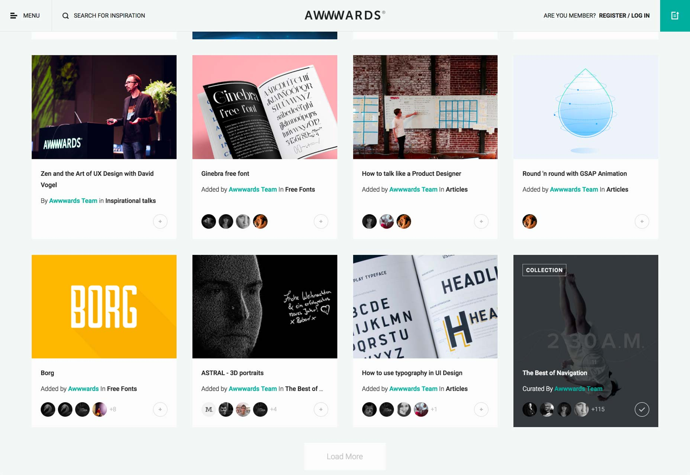

# React homework

## Overview

Develop the app with two divs on the page.
The first div should contain a search bar that allows to make a request to the certain api. The results of the request should be displayed using cards below the search bar.
The second div should be a form that allows to enter information and display it as cards with records below.
Also the second tab will be used to display the information from a card that was clicked on.

The homework should be done in one codesandbox. Below are the steps with detailed requirements.

  **The usage of Redux or any other solutions for state management is prohibited.**

  **The usage of any libraries with components or form libraries is prohibited.** 

## Steps

1. Create a new app using the React template on https://codesandbox.io
2. Use function components with hooks.
3. Draw the Search Bar and Cards in the div tag with id "search-bar".
Example: [Full React Course 2020 - Props](https://www.youtube.com/watch?v=4UZrsTqkcW4&t=8419s)
4. Input value should be saved to LocalStorage during component’s unmount. During the initialization pick the value from LocalStorage and show it.

useEffect: [Full React Course 2020 - useEffect](https://www.youtube.com/watch?v=4UZrsTqkcW4&t=17247s)

Example of using Local Storage: [How to use Local Storage in JavaScript](https://www.youtube.com/watch?v=k8yJCeuP6I8)

LocalStorage and other storage options: [JS Cookies vs Local Storage vs Session Storage (timecode)](https://youtu.be/GihQAC1I39Q?t=274)

All logical parts should be set into separate components.
Try to make it simple.

* examples of Search Bar:



* examples of Cards:




4. Create a component with form in a new div tag with id "form-component".
5. Form should be implemented using uncontrolled components.
6. Add functionality to your app:
   +  Collect information through a form
   +  You can collect any type of information, but form has to include at least one control of the following types:
      + text input
      + date input
      + dropdown/select
      + checkbox
      + switcher
      + file upload (image)

   **Example:**
     ```
     text input - name, surname, zip-code;
     date input - birthday, date of delivery;
     dropdown/select - list of countries, list of states (User can choose only one element from the list)
     checkbox - "I consent to my personal data" field, list of extra presents (User can choose several items from the list)
     switcher - male/female, "I want to receive notifications about promo, sales, etc." / "I don’t want to receive notifications about promo, sales, etc."
     file upload - profile picture
     ```

   After the Submit button is clicked, all data from the form has to be displayed as Card in the cards list below the form. The confirmation message (with information that the data has been saved) should be displayed using simple window.alert or a custom modal window (use [this article](https://medium.com/tinyso/how-to-create-a-modal-component-in-react-from-basic-to-advanced-a3357a2a716a)), after that form has to be cleared.
   
   The quantity of cards should equal the number of form submissions (if the user filled in and submitted the form five times, then five cards have to be displayed under the form).

   ### **Form validation**
   
   Validation should happen after the **Submit** button was clicked. In case some field was filled incorrectly, then error messages should be displayed under it. The card mustn’t be created until the user fixes all errors.
   
   After changing the value of erroneous input, the reset should happen only for this particular field, but not for the others.
   
   Submit button should be disabled at initialization (before the first typing), and until the user fixes all errors.

All logical parts should be extracted into components.
   
All data must be stored in a local state of the component.
   
Components should not make calls to APIs.

7. Choose an API.
   There are several recommended APIs. But you may choose any other API that you prefer if it supports search, pagination and sorting.
   - https://www.flickr.com/services/api/flickr.photos.search.html
   - https://the-one-api.dev/documentation
   - https://rickandmortyapi.com/documentation/
   - https://developers.themoviedb.org/3/getting-started/introduction
   - https://pipedream.com/apps/swapi
   - https://github.com/public-apis/public-apis
     **The API should support searching, pagination and sorting. Although you don’t need it at this stage, but there’s a good chance it might come in handy later.**
8. Use the search page from the first part and rewrite it. Split it into 2 logical parts:
   - **Search bar.** Enter text -> Press Enter -> Send the request to API with the searching parameters -> the list of results is updating
   - **The result list of searching**: display the data that the API query returned using Cards.
9. A customer decided to change requirement. Now every element of the list has to show a small piece of information. After the click on the element we have to show all the  available information about the element in the modal window. The modal window should be closed by clicking on the cross button in the upper right corner or by clicking on a page outside the modal window. When we open a modal window the page should be covered with overlay.
10. Create a download indicator (a component with animation, or at least with the string "Downloading"). You should place this indicator with your own sense of beauty.

All the logical parts must be in separated components.
**User-friendly interface with the downloading indicator and with notification messages in a case if something goes wrong or some information cannot be found is warmly welcome.**

11. Retain the functionality and **rewrite the form** with library **React Hook Form**. 
12. Implement state management solution using useReducer and Context API for search results and form data saving.
13. Add to global state
    - **switches for sorting** (at least three sorting options). Select a parameter -> send a request to the API with the entered parameter -> the list of search results is updated
    - **switches for pagination.** It should be possible to select the number of results per page and the number of the page we are currently on, the total number of pages. Select a parameter -> send a request to the API with the entered parameter -> the list of search results is updated

### Score

The task will be checked by the mentor during the first 6 weeks. Send a codesandbox link to your mentor.

1. Search bar + components – **2 points**
2. Form + Cards - **2 points**
3. API and modal window - **2 points**
4. Custom State Management - **2 points**
5. Sorting and pagination - **2 points**
6. Search details - **2 points**

If one of the items mentioned above is not accomplished – grade for the task is **0 points**. If there are direct DOM manipulations – **0 points**.

### Theory

* [Introducing Hooks](https://reactjs.org/docs/hooks-intro.html)
* [Rolling Scopes School Lithuania. React. Part 1](https://www.youtube.com/watch?v=L8CmtfCu9AI)
* [Rolling Scopes School Lithuania. React. Part 2](https://www.youtube.com/watch?v=Rrg4D6AHc5A)
* [Rolling Scopes School Lithuania. React. Part 3](https://www.youtube.com/watch?v=w9MvuGWVvkY)
* [Forms in React](https://reactjs.org/docs/forms.html)
* [Full React Tutorial #17 - Fetching Data with useEffect](https://www.youtube.com/watch?v=qdCHEUaFhBk&list=PL4cUxeGkcC9gZD-Tvwfod2gaISzfRiP9d&index=17)
* [Full React Tutorial #18 - Conditional Loading Message
  ](https://www.youtube.com/watch?v=qtheqr0jgIQ&list=PL4cUxeGkcC9gZD-Tvwfod2gaISzfRiP9d&index=18)
* [Full React Tutorial #19 - Handling Fetch Errors](https://www.youtube.com/watch?v=DTBta08fXGU&list=PL4cUxeGkcC9gZD-Tvwfod2gaISzfRiP9d&index=19)
* [Fetch Data from an API in React](https://www.youtube.com/watch?v=T3Px88x_PsA)
* [react-hook-form](https://react-hook-form.com/api/)
* [react-hook-form tutorial](https://www.youtube.com/watch?v=bU_eq8qyjic)
* [useReducer](https://reactjs.org/docs/hooks-reference.html#usereducer)
* [useContext](https://reactjs.org/docs/hooks-reference.html#usecontext)